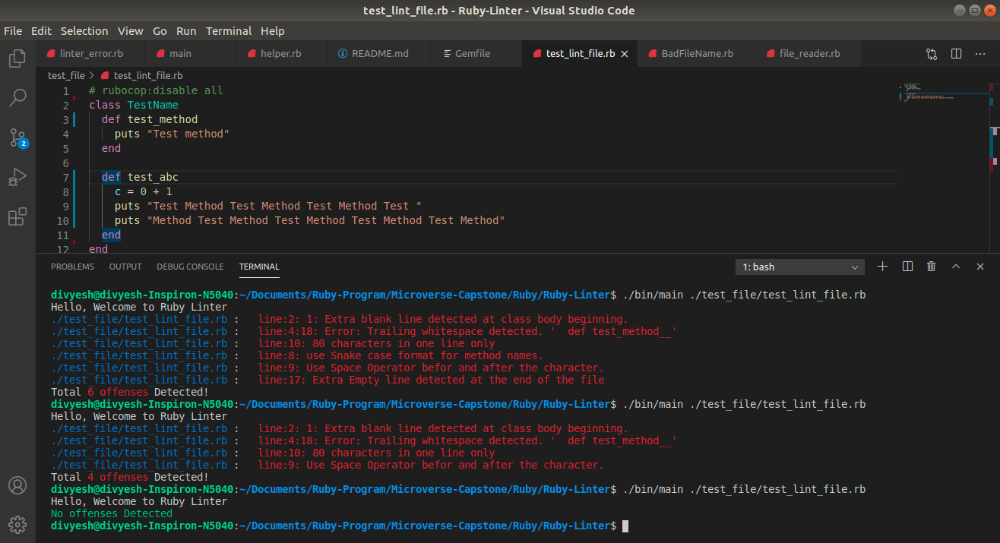

# Ruby-Linter
This is a simple application to analyze Ruby code styling error aka Linter

<p align="center"> 
  


</p>



## About The Project

This is the Ruby-Capstone Project. Main goal for this project was to build My own Linter Using Ruby language. It is a simple application to analyze Ruby code behavior and checks if the coding style is good or bad if it's bad then it will show the errors.

## Types of Inspections

I have used following types of inspections to analyze style error

- File Names
- Class Names
- Method Names
- Trailing Space
- Space around the operators
- Maximum line length
- Maximum file length
- leading empty line
- trailing empty line
- double space

## Comparision of Good and Bad code

#### File Name
```
# bad File Name

FileName

# Good File Name

file_name
```

####  Class Name
```
# Bad Class Name

class class_name
end

# Good class Name

class ClassName
end
```

#### Method Name
```
# Bad Method Name

def MethodName| <-- Use only snake case
end

# Good Method Name

def method_name
end
```


#### Space Operator
```
# bad
sum=1+2

# good
sum = 1 + 2
```

#### Trailing Space
```
# bad
def method_name |<-- Trailing space detected
end

# good
def method_name|
end
```


## Built With

- Ruby

## Live Demo

[Live Demo Link]()

## Getting Started

To get a local copy up and running follow these simple steps.

- clone This repository by using the following command on your local PC:

```
git clone https://github.com/Div685/Ruby-Linter.git
```
- After cloning you need to install some of the required dependencies using the following command:

```
bundle install
```
- To use the linter run the following command in the terminal
``` 
bin/main ./test_file/test_lint_file.rb
```


## Author

👤 **Divyesh Patel**

- GitHub: [@Div685](https://github.com/Div685)
- Twitter: [@div_685](https://www.linkedin.com/in/divyesh-patel-2a15a6107)
- LinkedIn: [Divyesh Patel](https://www.linkedin.com/in/divyesh-patel-2a15a6107)

## 🤝 Contributing

Contributions, issues, and feature requests are welcome!

Feel free to check the [issues page](https://github.com/Div685/Ruby-Linter/issues).

## Show your support

Give a ⭐️ if you like this project!

## Acknowledgements
followed Ruby style guide and selected some of the inspection to analyze the linter file
- [Ruby Guides](https://www.rubyguides.com/)
- [Ruby Docs](https://ruby-doc.org/)
- [Ruby Style Guide](https://rubystyle.guide/)
